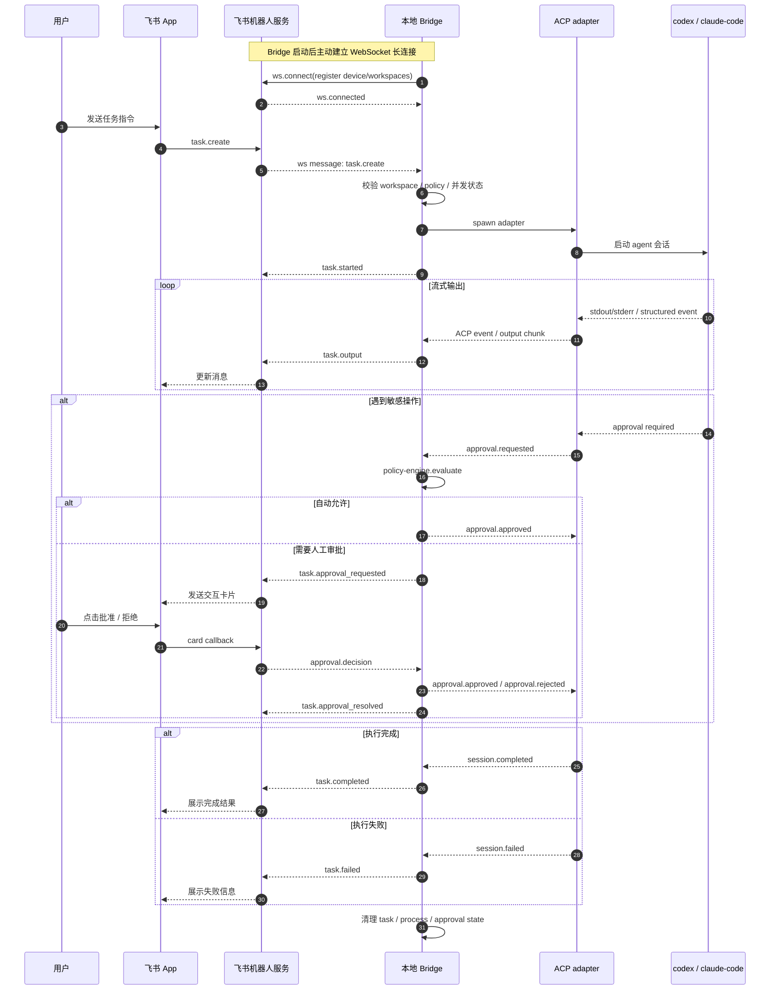
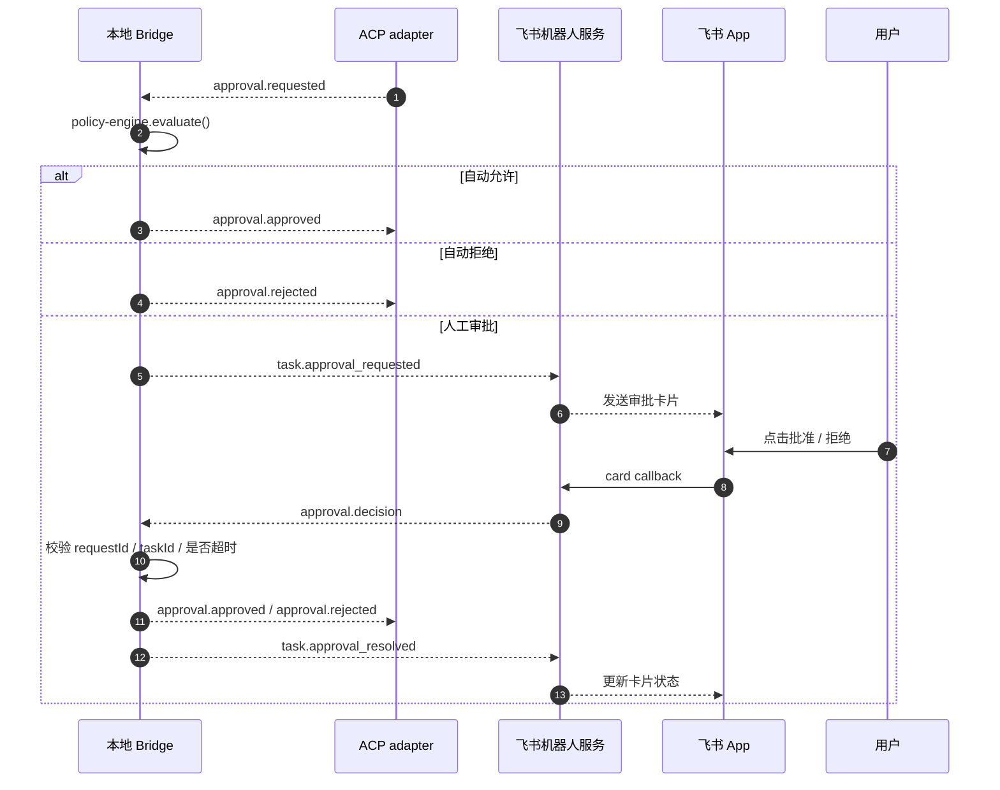

# IM Code Agent MVP 方案

## 目标

通过飞书机器人在手机或桌面端发起开发任务，由用户本地电脑上的 Bridge 服务驱动本地 ACP adapter 和本地安装的 `codex` / `claude-code` 执行任务。

约束：

- 纯本地执行，不做远程桌面或远程 shell
- 主要实现语言为 TypeScript
- Agent 协议使用 ACP，不使用 MCP
- 敏感操作必须可审批

第一版只解决最小闭环：

1. 飞书发起任务
2. 本地 Bridge 启动 agent 会话
3. 实时回传输出
4. 敏感操作暂停审批
5. 审批后继续执行或终止

## 总体架构

```text
飞书 App
  -> 飞书机器人服务
  -> WebSocket
  -> 本地 Bridge
  -> stdio (ACP)
  -> ACP adapter
  -> codex / claude-code
```

设计原则：

- Bridge 主动连出，不要求飞书云端直接访问本地网络
- Bridge 负责进程管理、策略判定和消息转发
- ACP adapter 负责与 agent CLI 建立 ACP 会话，不承担业务状态
- Agent CLI 继续作为本地执行体，不直接暴露给飞书侧

## 组件职责

### 飞书 App

- 接收用户输入
- 展示任务状态和流式输出
- 承载审批卡片交互

### 飞书机器人服务

- 接飞书事件
- 维护和本地 Bridge 的 WebSocket 连接
- 转发任务、审批和状态消息
- 把 Bridge 事件映射为飞书消息或卡片

### 本地 Bridge

- 注册本机设备和可用工作区
- 维护到飞书机器人服务的长连接
- 创建和管理任务生命周期
- 启动本地 ACP adapter / agent 进程
- 处理审批、权限策略和输出转发

### ACP adapter

- 与 Bridge 通过 stdio 交换 ACP 消息
- 驱动目标 agent CLI
- 向 Bridge 暴露结构化事件和审批节点

说明：

- `acpx` 可以作为 ACP client 或调试工具使用
- 但它不是当前架构里的固定组成部分
- 当前实现应优先围绕“Bridge 对接 ACP adapter”建模，而不是把 `acpx` 写死进核心架构

### codex / claude-code

- 实际执行编码任务
- 通过 ACP 被驱动

## 生产链路

生产环境的正式控制面是 WebSocket 消息，不是本地 HTTP API。

原因：

- 本地机器通常不可被云端直接访问
- 由 Bridge 主动连出更符合“纯本地执行”的约束
- WebSocket 更适合推送流式输出和任务状态

本地 HTTP 仅保留少量调试接口，例如：

- `GET /health`
- `POST /debug/tasks`
- `POST /debug/approvals/:id`

这些接口不作为正式生产入口。

## 核心时序

### 任务主流程



### 审批子流程



## MVP 范围

第一版刻意收缩：

- 单用户
- 单机
- 单个飞书应用
- 单工作区单任务串行
- 先支持一个 agent
- 固定工作目录白名单
- 审批类型只覆盖 `write`、`exec`、`network`
- 任务完成即销毁，不做长期会话恢复

第一版不做：

- 多轮上下文持久化
- 多设备同步
- 复杂角色权限
- 任意目录访问
- 公网暴露本地服务
- 网页管理后台

## 推荐目录结构

```text
apps/
  bridge/
  website/
packages/
  shared/
```

说明：

- `apps/bridge` 是主服务，必须优先实现
- `apps/website` 仅用于本地调试面板，可后置
- `packages/shared` 放共享类型、协议和配置 schema

如果要尽快验证协议，可先只实现：

```text
apps/
  bridge/
packages/
  shared/
```

## Bridge 模块划分

建议 `apps/bridge/src` 按下面拆分：

```text
src/
  index.ts
  config/
    load-config.ts
  server/
    ws-client.ts
    debug-http-server.ts
  session/
    session-manager.ts
    task-runner.ts
  agent/
    agent-process.ts
    agent-adapter.ts
  approval/
    approval-gateway.ts
    approval-store.ts
  policy/
    policy-engine.ts
  feishu/
    message-mapper.ts
  utils/
    logger.ts
    path-safety.ts
```

模块职责：

- `ws-client`
  - 管理到飞书机器人服务的长连接
  - 发送和接收结构化消息
- `debug-http-server`
  - 提供本地调试接口
- `session-manager`
  - 创建、查询、取消任务
  - 保证单工作区串行
- `task-runner`
  - 协调整个任务执行流程
- `agent-process`
  - 启动本地 ACP adapter / agent 进程
  - 处理 stdio 和 ACP 消息
- `agent-adapter`
  - 屏蔽不同 agent CLI 的启动差异
- `approval-gateway`
  - 处理审批请求和决策回写
- `approval-store`
  - 记录待审批项
- `policy-engine`
  - 做自动允许、自动拒绝、人工审批判定
- `message-mapper`
  - 在内部事件和飞书消息之间做映射

## shared 包设计

`packages/shared` 应只承载稳定类型：

- `config.ts`
- `task.ts`
- `events.ts`
- `approval.ts`
- `agent.ts`

建议先冻结以下领域模型：

- `BridgeConfig`
- `Task`
- `TaskStatus`
- `BridgeEvent`
- `ApprovalRequest`
- `ApprovalDecision`
- `WorkspaceConfig`

## 配置模型

建议 Bridge 使用显式本地配置文件，而不是依赖飞书请求动态传入敏感信息。

示例：

```ts
export type BridgeConfig = {
  deviceId: string;
  wsUrl: string;
  debugPort?: number;
  agents: {
    codex?: {
      command: string;
      args?: string[];
    };
    claudeCode?: {
      command: string;
      args?: string[];
    };
  };
  workspaces: Array<{
    id: string;
    name: string;
    cwd: string;
    approvalMode: "ask" | "read-auto" | "read-write-auto";
    blockedPaths?: string[];
    allowedAgents: Array<"codex" | "claude-code">;
  }>;
};
```

配置原则：

- `workspace` 必须预注册
- 飞书侧只能引用 `workspaceId`
- `cwd` 不允许由飞书自由传入
- 黑名单目录必须做真实路径校验
- 每个工作区单独约束允许的 agent

## 任务模型

```ts
export type TaskStatus =
  | "pending"
  | "running"
  | "waiting_approval"
  | "completed"
  | "failed"
  | "cancelled";

export type Task = {
  id: string;
  workspaceId: string;
  agent: "codex" | "claude-code";
  prompt: string;
  cwd: string;
  status: TaskStatus;
  createdAt: string;
  startedAt?: string;
  endedAt?: string;
};
```

第一版不扩展 transcript、重试、恢复指针等复杂状态。

## 事件模型

Bridge 对内对外都建议使用统一事件流：

```ts
export type BridgeEvent =
  | TaskStartedEvent
  | TaskOutputEvent
  | TaskApprovalRequestedEvent
  | TaskApprovalResolvedEvent
  | TaskCompletedEvent
  | TaskFailedEvent
  | TaskCancelledEvent;
```

示例：

```ts
export type TaskOutputEvent = {
  type: "task.output";
  taskId: string;
  stream: "stdout" | "stderr";
  chunk: string;
  timestamp: string;
};
```

```ts
export type TaskApprovalRequestedEvent = {
  type: "task.approval_requested";
  taskId: string;
  request: ApprovalRequest;
  timestamp: string;
};
```

统一事件流的价值：

- 降低飞书适配层复杂度
- 方便未来增加本地调试页
- 输出、审批、状态都能走同一条消息通道

## WebSocket 消息边界

正式环境建议分成两类消息：

Bridge 接收：

- `task.create`
- `task.cancel`
- `approval.decision`
- `ping`

Bridge 发送：

- `bridge.register`
- `bridge.ready`
- `task.started`
- `task.output`
- `task.approval_requested`
- `task.approval_resolved`
- `task.completed`
- `task.failed`
- `task.cancelled`
- `pong`

这里的消息模型应保持接近 `BridgeEvent`，不要为飞书单独定义一套完全不同的结构。

## 审批模型

审批请求必须结构化，避免只传一段不可解析文本。

```ts
export type ApprovalKind = "read" | "write" | "exec" | "network";

export type ApprovalRequest = {
  id: string;
  taskId: string;
  kind: ApprovalKind;
  title: string;
  cwd: string;
  target?: string;
  command?: string;
  diffPreview?: string;
  reason?: string;
  riskLevel: "low" | "medium" | "high";
  createdAt: string;
  expiresAt: string;
};
```

```ts
export type ApprovalDecision = {
  requestId: string;
  taskId: string;
  decision: "approved" | "rejected";
  comment?: string;
  decidedAt: string;
  decidedBy: string;
};
```

风险分级建议：

- `read`: low
- `write`: medium
- `exec`: high
- `network`: high

## 权限策略

第一版策略尽量简单：

- `read`
  - 在工作区内自动允许
- `write`
  - 默认人工审批
- `exec`
  - 默认人工审批
- `network`
  - 默认人工审批，必要时直接拒绝

策略引擎建议返回：

```ts
export type PolicyDecision =
  | { type: "allow" }
  | { type: "deny"; reason: string }
  | { type: "ask"; reason: string };
```

判定顺序：

1. 路径标准化
2. 真实路径解析
3. 是否落在工作区内
4. 是否命中黑名单
5. 是否按 `approvalMode` 自动放行
6. `exec` 和 `network` 强制审批

## 安全边界

必须从第一版就处理：

- 路径统一走 `resolve + realpath`
- 拒绝通过软链接逃逸工作区
- Bridge 不暴露任意 shell 能力
- 审批请求必须带 `requestId` 和 `taskId`
- 审批超时默认拒绝
- WebSocket 断线时终止运行中的任务
- 卡片重复点击只接受第一次有效结果

## 开发顺序

按风险优先，而不是按页面优先：

1. `packages/shared`
   - 定义核心类型
2. `apps/bridge`
   - 配置加载、日志、任务管理骨架
3. ACP adapter 最小集成
   - 能启动、能收输出、能退出
4. 本地调试入口
   - 不接飞书，先本地验证任务链路
5. 审批闭环
   - 先本地模拟审批
6. 飞书接入
   - 文本消息、卡片、回调
7. 策略和安全加固
   - 黑名单、超时、串行和取消

## 首批 PoC 验证点

在正式开发前，先验证下面四件事：

1. Bridge 能稳定拉起本地 ACP adapter
2. ACP adapter 能稳定驱动目标 agent
3. 敏感操作节点能暂停并等待外部决策
4. 审批后任务能够继续或终止

如果这四点里有任何一点不成立，后续实现会被迫重构，因此应优先完成 PoC。
